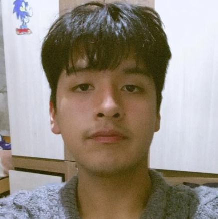

PROCESOS DE INNOVACIÓN EN INGENIERÍA - EQUIPO 2

Carreras de ingeniería Ambiental/Informática/Industrial 
Universidad Peruana Cayetano Heredia 

Descripción del equipo:
Somos el equipo 02 del curso de Procesos de Innovación en Ingeniería 2026-II, conformado por estudiantes de la carrera de Ingeniería Ambiental/Informática/Industrial.

Nuestro objetivo es desarrollar la capacidad de proponer soluciones innovadoras y creativas a desafíos relacionados con los objetivos de desarrollo sostenible usando el enfoque de Design Thinking.

Nos interesa trabajar en los siguientes Objetivos de Desarrollo Sostenible (ODS):

  

| Foto | Nombre | Rol | Intereses |
| --- | --- | --- | --- |
|  | Joaquín Severo Silva Salazar | Encargado de documentación | Comunicación científica y redacción técnica |
|  | Sebastián Omar Escalante Agama | Líder del equipo | Sostenibilidad, Innovación social, Diseño de prototipos |
|  | Zayury Danitza Dionicio Tomas | Redactora | Redacción académica y corrección ortográfica |
|  | Sneyder Jair Huerta Macedo | Responsable de Investigación | Gestión ambiental, Desarrollo Comunitario |
|  | Xiomara Huillcamascco Marca | Diseñadora | Diseño de prototipos, creatividad aplicada |

Integrantes del equipo: 

FOTO
NOMBRE
ROL 
INTERESES
*FOTO
Joaquin Severo Silva Salazar 
Encargado de documentación
Comunicación científica y redacción técnica

Sebastian Omar Escalante Agama
Líder del equipo

Zayury Danitza Dionicio Tomas 

Sneyder Jair Huerta Macedo 
Responsable de Investigación
Gestión ambiental, Desarrollo Comunitario

Xiomara Huillcamascco Marca
Diseñadora 
Diseño de prototipos, creatividad aplicada

Resumen final:

Este README deja ver nuestro enfoque en la importancia de cada uno de los ODS planteados para la correcta implementación de nuestro futuro proyecto, respetando cabalmente la normativa que se plantea y enfocándonos en impulsar nuestras ideas para concretar situaciones de innovación con un impacto positivo, claro y viable.
